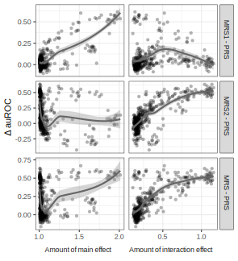

## Results

### MRS outperforms standard PRS in the majority of simulated datasets

In 335 out of 450 simulated datasets, MRS produces higher auROC compared to PRS (green lines, Fig. {@fig:auroc_mrs_prs}).
In 363 datasets where the standard PRS method performs poorly (auROC < 60%), MRS performs particularly well (auROC > 90%) in 102 datasets.
When MRS yields smaller auROC, the difference is small (3.3% ± 2.8%, purple lines/areas).
Across all datasets, the improvement of MRS over PRS is significant (P < $10^{-15}$) according to a Wilcoxon signed rank test.
To assess whether this improvement in performance correlates with the amount of interaction effects contained in each dataset, in the following section, we untangled the two components of MRS and test for the correlation between the difference in auROC and two entropy-based measures, main and interaction effect, of each dataset.

{#fig:auroc_mrs_prs width="80%"}

### Assess improvement in performance
Individually, MRS1 and MRS2 both significantly outperformed the standard PRS method (both P values < $10^{-15}$) according to a Wilcoxon signed rank test.
As the amount of main effects increases (Fig. {@fig:improvements} left column), MRS1 increasingly performs better than PRS, which is likely because encodings are inferred (top left).
Meanwhile, MRS2's accuracy remain mostly similar to that of PRS (middle left).
On the other hand, when the amount of interaction effects increases (Fig. {@fig:improvements} right column), MRS1 performs mostly on par to PRS while MRS2 increasingly performs better than PRS.
Combining the gain from both MRS1 and MRS2, MRS's performance progressively increases compared to the standard PRS.

{#fig:improvements width="70%"}